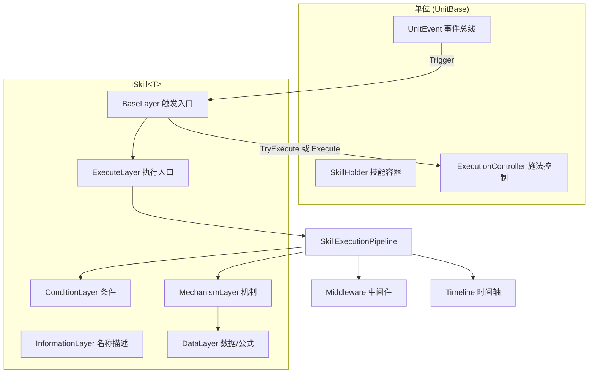

# TechCosmos 技能系统 (Skill System)

> **包名**: `com.techcosmos.skillsystem`  
> **当前版本**: **2.3.0**  
> **Unity**: 2022.3+  
> **语言**: C# 9.0+ / .NET Standard 2.1

面向 Unity 的**企业级、数据驱动、可扩展**技能框架。将技能抽象为**六层架构**，内置 **Buff 子系统（GBF）**、**条件树 / 机制树**、**技能时间轴**、**施法状态机**、**执行管线与中间件**，并提供 Shader Graph 风格的**节点图编辑器**与完整的 **Editor 工具链**。

---

## 目录

- [0. 版本亮点](#0-版本亮点)
- [1. 5 分钟看懂](#1-5-分钟看懂)
- [2. 安装与 Samples](#2-安装与-samples)
- [3. 快速上手（完整流程）](#3-快速上手完整流程)
- [4. 架构设计](#4-架构设计)
- [5. 运行时系统详解](#5-运行时系统详解)
  - [5.1 六层架构](#51-六层架构)
  - [5.2 执行管线](#52-执行管线-skillexecutionpipeline)
  - [5.3 施法控制器](#53-施法控制器-skillexecutioncontroller)
  - [5.4 条件系统与条件树](#54-条件系统与条件树)
  - [5.5 机制系统与机制树](#55-机制系统与机制树)
  - [5.6 数据层与公式](#56-数据层与公式)
  - [5.7 技能时间轴](#57-技能时间轴-timeline)
  - [5.8 UnitBase 与事件系统](#58-unitbase-与事件系统)
  - [5.9 Buff 子系统](#59-buff-子系统)
  - [5.10 中间件](#510-中间件-iskillmiddleware)
  - [5.11 网络扩展点](#511-网络扩展点)
  - [5.12 黑板与执行元数据](#512-黑板与执行元数据)
- [6. 编辑器工具指南](#6-编辑器工具指南)
- [7. 代码生成系统](#7-代码生成系统)
- [8. 实战食谱 (Cookbook)](#8-实战食谱-cookbook)
- [9. API 速查](#9-api-速查)
- [10. 项目结构](#10-项目结构)
- [11. 最佳实践](#11-最佳实践)
- [12. 常见问题 FAQ](#12-常见问题-faq)
- [13. 版本升级说明](#13-版本升级说明)

---

## 0. 版本亮点

| 能力 | 说明 |
|------|------|
| **条件树** | AND / OR / NOT / Ref，支持 `CompositeConditionSO` 复用 |
| **机制树** | Sequence / Parallel / Ref，支持 `CompositeMechanismSO` 复用 |
| **Timeline** | 技能成功执行后按时间轴触发机制或单位事件 |
| **施法状态机** | 读条 `castTime`、引导 `channelTime`、打断与优先级 |
| **执行管线** | 中间件 → 条件 → 机制 → 时间轴，带 Profiler 与 Trace |
| **UnitBase** | 一行继承集成事件、技能容器、Buff、施法控制器 |
| **内置 Buff** | 无需单独安装 BuffSystem 包 |
| **Graph 编辑器** | Skill / Buff / Condition / Mechanism 节点图 |
| **资产校验** | 一键扫描所有 SkillDataSO 配置问题 |
| **Samples** | 可导入 Demo 场景（攻击 / 治疗 / Buff） |
| **单元测试** | Formula / Tag / Buff / Cooldown / 条件树编译 |

> v2.2.0 起 Buff 已内置；若项目中仍有旧包 `Tech-Cosmos.Framework.BuffSystem`，请删除以避免重复编译。

---

## 1. 5 分钟看懂

### 技能是什么？

一个 `ISkill<T>` 实例 = **六层组合** + **Profile 配置** + **可选 Timeline**。

```
事件触发 → BaseLayer → ExecuteLayer → Pipeline
                              ├─ 中间件拦截
                              ├─ ConditionLayer 检查
                              ├─ MechanismLayer 执行效果
                              └─ Timeline 延迟触发
```

### 策划配什么？

| 资产 | 用途 |
|------|------|
| `SkillDataSO` | 技能：触发事件、条件树、机制树、数值、Timeline |
| `BuffDataSO` | Buff：时长、叠层、修改器、效果执行器 |
| `CompositeConditionSO` | 可复用条件组合 |
| `CompositeMechanismSO` | 可复用机制组合 |

### 程序写什么？

| 代码 | 用途 |
|------|------|
| `UnitBase<T>` 子类 | 游戏角色，暴露 `[SkillDataField]` 数值 |
| `Mechanism<T>` 子类 | 技能效果（伤害、治疗、施加 Buff…） |
| `Condition<T>` 子类 | 释放条件（冷却、标签、Buff 层数…） |

### 最小运行代码

```csharp
// 1. 定义 Unit
public class Hero : UnitBase<Hero>
{
    [SkillDataField(DisplayName = "攻击力")] public float Attack = 10f;
    public override string[] GetSupportedEvents() => new[] { "OnAttack" };
}

// 2. 生成代码：菜单 Generate ALL Classes

// 3. 创建 SkillDataSO 资产并配置

// 4. 运行时挂载
var so = Resources.Load<SkillDataSO<Hero>>("Skills/Slash");
hero.AddSkill(SkillFactory<Hero>.CreateSkill(so));

// 5. 触发
hero.TriggerEvent("OnAttack", enemy);
```

---

## 2. 安装与 Samples

### 安装方式

**方式 A — UPM 本地包**

将本仓库放到项目的 `Packages/` 或 `Assets/` 下，在 `manifest.json` 中添加：

```json
"com.techcosmos.skillsystem": "file:../Tech-Cosmos.Framework.SkillSystem"
```

**方式 B — 直接复制**

将整个 `Tech-Cosmos.Framework.SkillSystem` 文件夹复制到 `Assets/` 下。

### 导入 Demo Sample

1. 打开 **Package Manager** → 找到 **SkillSystem**
2. 展开 **Samples** → 导入 **Skill System Demo**
3. 菜单 **`Tech-Cosmos → SkillSystem → Samples → Create Demo Scene`**
4. 运行场景：**Space** 攻击，**H** 治疗

Demo 核心类型：

| 类型 | 说明 |
|------|------|
| `DemoCharacter` | 继承 `UnitBase`，带 Attack / Health |
| `DemoDamageMechanism` | 示例伤害机制 |
| `DemoHealMechanism` | 示例治疗机制 |
| `DemoSceneController` | 键盘输入与技能绑定 |

---

## 3. 快速上手（完整流程）

### Step 1 — 创建 Unit

**推荐**：继承 `UnitBase<T>`，自动获得事件总线、技能容器、Buff、施法控制器。

```csharp
using UnityEngine;
using TechCosmos.SkillSystem.Runtime;

[GenerateSkillDataSO(MenuName = "Tech-Cosmos/Skill/Hero")]
public class Hero : UnitBase<Hero>
{
    [SkillDataField(Category = "战斗", DisplayName = "攻击力")]
    public float Attack = 15f;

    [SkillDataField(Category = "战斗", DisplayName = "当前生命")]
    public float Health = 100f;

    public override string[] GetSupportedEvents()
        => new[] { "OnAttack", "OnDamaged", "OnDeath" };

    public void TakeDamage(float amount)
    {
        Health = Mathf.Max(0f, Health - amount);
        if (Health <= 0f) TriggerEvent("OnDeath");
    }
}
```

> 若需完全自定义，也可直接实现 `IUnit<T>` + `ISkillExecutionOwner<T>` + `IBuffHost<T>`，但工作量更大。

### Step 2 — 生成封闭泛型代码

```
Tech-Cosmos → SkillSystem → Generator → Generate ALL Classes
```

生成输出（默认路径）：

```
Assets/Generated/
├── Mechanisms/     ← Mechanism<T> 的封闭子类 *.g.cs
├── Conditions/     ← Condition<T> 的封闭子类 *.g.cs
└── SkillDataSO/    ← HeroSkillDataSO 等
```

> **每次新增/修改带 `[AutoGenerateMechanism]` / `[AutoGenerateCondition]` 的类后都要重新生成。**

### Step 3 — 编写机制

```csharp
[Serializable]
[RequiredData("DamageMultiplier", typeof(float), DefaultValue = "1.5", Description = "伤害倍率")]
[RequiredData("DamageFormula", typeof(float), IsFormula = true,
    FormulaType = FormulaValue.FormulaType.Custom,
    CustomFormula = "caster.Attack * 1.5",
    Description = "伤害公式")]
[AutoGenerateMechanism(typeof(Hero))]
[MechanismMenu("⚔ 伤害", DisplayName = "造成伤害", Priority = 1)]
public class DamageMechanism<T> : Mechanism<T> where T : class, IUnit<T>
{
    public override void Execute(SkillContext<T> context, IDataLayer<T> dataLayer)
    {
        float multiplier = dataLayer.GetValue<float>("DamageMultiplier", context);
        float formulaDamage = dataLayer.GetValue<float>("DamageFormula", context);
        float finalDamage = formulaDamage * multiplier;
        Debug.Log($"[Damage] {context.caster} → {context.target} : {finalDamage}");
    }
}
```

再次运行 **Generate ALL Classes**。

### Step 4 — 创建并配置 SkillDataSO

1. Project 右键 → **Create → Tech-Cosmos → Skill → Hero**
2. 打开 **`Tech-Cosmos → SkillSystem → Skill Editor Window`**
3. 配置各面板：

| 面板 | 配置项 |
|------|--------|
| **基础** | 名称、描述、主动/被动、`TriggerEvents` |
| **Profile** | 优先级、读条、引导、可打断、标签 |
| **条件树** | 添加 Leaf → 选择 `CooldownCondition` 等 |
| **机制** | 平铺列表 或 启用机制树 |
| **Timeline** | 可选：分段触发机制/事件 |
| **数据层** | `[RequiredData]` 自动同步的键值 |

4. 保存资产

### Step 5 — 运行时挂载与触发

```csharp
public class GameBootstrap : MonoBehaviour
{
    public Hero hero;
    public Hero enemy;
    public SkillDataSO heroSlashSO;

    void Start()
    {
        if (heroSlashSO is SkillDataSO<Hero> typedSO)
            hero.AddSkill(SkillFactory<Hero>.CreateSkill(typedSO));
    }

    void Update()
    {
        if (Input.GetKeyDown(KeyCode.Space))
            hero.TriggerEvent("OnAttack", enemy);
    }
}
```

**被动技能**：`SkillType = Passive` 时，`AddSkill` 会立即执行一次。

---

## 4. 架构设计

### 4.1 六层 + 管线总览



### 4.2 一次技能执行的完整时序

```
1. 外部调用 unit.TriggerEvent("OnAttack", context)
2. UnitEvent 按优先级调用各技能 BaseLayer.Trigger
3. ActiveBaseLayer：
   - 若 caster 有 ExecutionController → TryExecute（可能进入读条/引导）
   - 否则 → ExecuteLayer.Execute
4. SkillExecutionPipeline.Execute：
   a. 分配 executionId，WithSkill 绑定当前技能
   b. 全局 + 局部 Middleware.OnBeforeExecute（可 cancel）
   c. 触发 Executing 事件（实例 + 全局）
   d. ConditionLayer.CheckCondition
      - 失败 → OnConditionFailed 回调 + Failed 事件 → 返回 ConditionFailed
   e. MechanismLayer.Mechanism（ContinueOnError / FailFast）
   f. 条件 OnSkillExecuted 回调（如 Cooldown 开始计时）
   g. Middleware.OnAfterExecute
   h. Executed 事件
   i. 若 Timeline.enabled → SkillTimelineService.Play
5. Timeline Tick 到各 clip 时间点 → 执行机制或 TriggerEvent
```

### 4.3 泛型 / 非泛型双轨

| 层级 | 泛型（运行时类型安全） | 非泛型（Unity 序列化） |
|------|------------------------|------------------------|
| 条件 | `Condition<T>` | `ConditionBase` + `[SerializeReference]` |
| 机制 | `Mechanism<T>` | `MechanismBase` + `[SerializeReference]` |
| 配置 | `SkillDataSO<T>` | `SkillDataSO` |

编辑器里配置的是非泛型基类；`GetSkillData()` / `SkillFactory` 编译为泛型运行时实例。

---

## 5. 运行时系统详解

### 5.1 六层架构

| 层 | 接口 | 职责 |
|----|------|------|
| 基础层 | `IBaseLayer<T>` | 订阅 `TriggerEvents`，作为技能入口 |
| 信息层 | `IInformationLayer<T>` | 名称、描述 |
| 条件层 | `IConditionLayer<T>` | 前置条件检查 |
| 机制层 | `IMechanismLayer<T>` | 执行游戏效果 |
| 数据层 | `IDataLayer<T>` | 键值存储、公式/随机求值 |
| 执行层 | `IExecuteLayer<T>` | 转发至 Pipeline，广播生命周期事件 |

**主动 vs 被动**

| 类型 | BaseLayer 实现 | 行为 |
|------|----------------|------|
| `SkillType.Active` | `ActiveBaseLayer` | 等事件触发后执行 |
| `SkillType.Passive` | `PassiveBaseLayer` | `AddSkill` 时立即执行一次，之后随事件触发 |

### 5.2 执行管线 SkillExecutionPipeline

```csharp
var result = SkillExecutionPipeline.Execute(
    skill,
    context,
    middleware: myMiddlewareList,           // 可选：本次执行的局部中间件
    mechanismPolicy: MechanismErrorPolicy.ContinueOnError);

// result 枚举：
// Success | ConditionFailed | Cancelled | Casting | Channeling | Blocked | Error
```

**Profiler 标记**：`SkillProfilerMarkers.Execute / Condition / Mechanism / Formula`

**Trace 记录**：`SkillExecutionTrace.Record(skill, context, result)` 用于调试统计。

### 5.3 施法控制器 SkillExecutionController

配置在 `SkillProfile` 上：

```csharp
public class SkillProfile
{
    public int executionPriority;   // 越大越优先；高优先级可打断低优先级
    public float castTime;          // 读条时间（秒）
    public float channelTime;      // 引导时间（秒）
    public bool canBeInterrupted;  // 是否可被伤害/沉默等打断
    public List<string> tags;      // 技能标签
}
```

**流程**：

```
castTime > 0 或 channelTime > 0
    → BeginCast → Phase = Casting
    → castTime 结束 → Phase = Channeling（若有）或直接 CompleteCast
    → channelTime 结束 → CompleteCast → Pipeline.Execute

castTime == 0 && channelTime == 0
    → 直接 Pipeline.Execute
```

**打断**：

```csharp
hero.ExecutionController.TryInterrupt(InterruptReason.Damage);
hero.ExecutionController.Cancel(); // Manual
```

**前提**：施法者需实现 `ISkillExecutionOwner<T>`（`UnitBase` 已实现）。  
`ActiveBaseLayer` 会自动检测并走 `TryExecute`。

### 5.4 条件系统与条件树

#### 代码组合（运行时）

```csharp
var cond = healthCheck & manaCheck | !stunCheck;
// & → AndCondition   | → OrCondition   ! → NotCondition
// 建议使用 ConditionPool<T> 减少 GC
```

#### 内置条件

| 条件 | 说明 |
|------|------|
| `CooldownCondition<T>` | 冷却；成功执行后 `OnSkillExecuted` 开始计时 |
| `HasBuffCondition<T>` | 检查 Buff 存在与层数 |
| `HasTagCondition<T>` | 检查 `TagContainer` 标签 |
| `FuncCondition<T>` | Lambda 包装 |
| `CachedCondition<T>` | 结果缓存装饰器 |
| `And/Or/NotCondition<T>` | 逻辑组合 |

#### 条件树（编辑器 / SO 配置）

节点类型：

| 节点 | 说明 |
|------|------|
| `ConditionTreeLeaf` | 单个条件实例 |
| `ConditionTreeAnd` | 全部满足 |
| `ConditionTreeOr` | 任一满足 |
| `ConditionTreeNot` | 取反 |
| `ConditionTreeRef` | 引用 `CompositeConditionSO` |

编译：`ConditionTreeCompiler.Compile<T>(root)` → 单个 `Condition<T>`（通常是 And/Or 嵌套）。

`SkillDataSO` 字段：

```csharp
public bool useConditionTree = true;          // 默认启用条件树
public ConditionTreeNodeBase conditionTreeRoot;
public List<ConditionBase> Conditions;        // 旧版平铺列表（useConditionTree=false）
```

#### 复合条件资产

```
Create → Tech-Cosmos → SkillSystem → Composite Condition
```

可在多个技能的条件树中通过 **Ref 节点** 引用，避免重复配置。

### 5.5 机制系统与机制树

#### 机制类型

| 类型 | 说明 |
|------|------|
| 序列化机制 | `Mechanism<T>` 子类，Inspector 可配字段 |
| 委托机制 | `Action<SkillContext<T>>`，仅代码构建 |
| 组合机制 | `SequenceMechanism` / `ParallelMechanism`（编译产物） |

#### 内置机制

| 机制 | 说明 |
|------|------|
| `ApplyBuffMechanism<T>` | 施加 `BuffDataSO` 或 `SimpleBuff` |
| `RemoveBuffMechanism<T>` | 按名称/标签移除 Buff |

#### 机制树

| 节点 | 运行时语义 |
|------|------------|
| `MechanismTreeLeaf` | 执行单个机制 |
| `MechanismTreeSequence` | 顺序执行子节点 |
| `MechanismTreeParallel` | 同批次执行（单线程依次调用） |
| `MechanismTreeRef` | 引用 `CompositeMechanismSO` |

`SkillDataSO` 字段：

```csharp
public bool useMechanismTree;                   // 默认 false，使用平铺列表
public MechanismTreeNodeBase mechanismTreeRoot;
public List<MechanismBase> Mechanisms;          // 旧版平铺
```

#### SkillBack 回滚

```csharp
public override void SkillBack(ISkill<T> skill)
{
    // 技能 RemoveSkill / OnRemove 时调用，用于清理 Buff、还原状态
}
```

`MechanismLayer.InvokeSkillBack` 在 `Skill.OnRemove()` 时逆序触发。

#### 错误策略

```csharp
mechanismLayer.ErrorPolicy = MechanismErrorPolicy.FailFast; // 默认 ContinueOnError
```

### 5.6 数据层与公式

#### 支持的值类型

| 类型 | 说明 |
|------|------|
| `float / int / string / bool` | 静态值 |
| `FormulaValue` | 静态 / 引用 / 表达式 / 自定义公式 |
| `RandomValue` | 随机范围 |
| 自定义 `[DataEntryType]` 类型 | 通过 `SerializableValue` 包装 |

#### 读取数据

```csharp
float dmg = dataLayer.GetValue<float>("DamageFormula", context);
```

`DataLayer` 会自动：
- 对 `FormulaValue` 调用 `FormulaEvaluator`
- 对 `RandomValue` 调用 `Resolve()`
- 对 `Func<SkillContext<T>, T>` 委托求值

#### 公式语法

```
caster.Attack * 1.5 + target.MaxHealth * 0.1
(caster.Attack - target.Defense) * 2.0
random(0, 100) * 0.01
```

支持：`+ - * /`、括号、`caster.xxx` / `target.xxx` 属性路径、`random(min,max)`。

#### RequiredData 自动同步

在机制/条件类上声明：

```csharp
[RequiredData("BuffId", typeof(string), DefaultValue = "Haste", Description = "Buff 标识")]
[RequiredData("DamageFormula", typeof(float), IsFormula = true,
    FormulaType = FormulaValue.FormulaType.Custom,
    CustomFormula = "caster.Attack * 2",
    AllowedTypes = new[] { typeof(float), typeof(FormulaValue) })]
```

编辑器会：自动创建条目、锁定防删（🔒）、检测类型冲突、显示依赖来源。

### 5.7 技能时间轴 Timeline

配置在 `SkillDataSO.Timeline`：

```csharp
public class SkillTimelineData
{
    public bool enabled;
    public float totalDuration;
    public List<SkillTimelineClip> clips;
}

public class SkillTimelineClip
{
    public SkillTimelineClipType clipType;  // Mechanism | EventMarker | PhaseLabel
    public float startTime;
    public float duration;
    public string eventName;              // EventMarker 用
    public MechanismBase mechanism;       // Mechanism 用
}
```

**触发时机**：Pipeline 执行 **成功后** 由 `SkillTimelineService.Play` 启动；`UnitBase.Update` 中自动 `SkillTimelineService.Tick`。

**EventMarker** 示例：在 0.5s 时触发 `"OnTimelineHit"`，可让另一个被动技能响应。

### 5.8 UnitBase 与事件系统

`UnitBase<T>` 集成：

| 组件 | 说明 |
|------|------|
| `UnitEvent<T>` | 事件订阅/发布，支持优先级 |
| `SkillHolder<T>` | 技能注册、被动激活、Remove 清理 |
| `BuffSystem<T>` | Buff 管理 |
| `TagContainer` | 状态标签，Buff 增删时自动同步 |
| `SkillExecutionController<T>` | 读条/引导/打断 |

```csharp
// 订阅
unitEvent.Subscribe("OnAttack", ctx => { }, priority: 10);

// 触发（UnitBase 封装）
hero.TriggerEvent("OnAttack", enemy);
hero.TriggerEvent("OnAttack", new SkillContext<Hero>(hero, enemy));

// 技能管理
hero.AddSkill(skill);
hero.TryGetSkill("重击", out var slash);
hero.RemoveSkill(skill);
```

**性能**：`UnitEvent` 缓存 listener 数组；递归触发深度 > 8 时中止并警告。

### 5.9 Buff 子系统

目录：`Runtime/Buff/GBF/`（核心引擎）+ 集成层。

#### 推荐用法

```csharp
public class Hero : UnitBase<Hero> { }  // 已内置 BuffSystem

// 数据驱动
var data = Resources.Load<BuffDataSO>("Buffs/Haste");
hero.BuffSystem.AddBuff(new ConfigurableBuff<Hero>(hero, data, caster));

// 代码轻量 Buff
hero.BuffSystem.AddBuff(new SimpleBuff<Hero>(
    hero, "Haste", duration: 5f, tags: new[] { "Buff" },
    modifiers: new[] { new StatModifier("Attack", ModifierOp.Add, 10f) },
    caster: hero, stackPolicy: BuffStackPolicy.StackAndRefresh, maxStacks: 3));

// 属性修正
float atk = hero.EvaluateStat("Attack", baseAttack);

// 驱散
hero.BuffSystem.DispelByTags("Debuff", "Poison");
```

#### 与技能集成

| 组件 | 用途 |
|------|------|
| `ApplyBuffMechanism` | 技能中施加 Buff |
| `RemoveBuffMechanism` | 技能中移除 Buff |
| `HasBuffCondition` | 条件：拥有指定 Buff |
| `HasTagCondition` | 条件：拥有指定标签 |

#### 叠层策略映射

| `ModifierStackPolicy`（机制） | `BuffStackPolicy`（GBF） |
|-------------------------------|--------------------------|
| Stack | StackAndRefresh |
| RefreshDuration | ExtendDuration |
| Replace | Replace |
| Ignore | 已存在则跳过 |

### 5.10 中间件 ISkillMiddleware

```csharp
public class LoggingMiddleware : SkillMiddlewareBase
{
    public override int Order => 100;

    public override bool OnBeforeExecute<T>(ISkill<T> skill, ref SkillContext<T> context)
    {
        Debug.Log($"即将执行: {skill.InformationLayer.Name}");
        return true; // false → 取消执行
    }

    public override void OnAfterExecute<T>(ISkill<T> skill, SkillContext<T> context, SkillExecutionResult result)
    {
        Debug.Log($"执行结果: {result}");
    }
}

// 注册全局中间件
SkillSystemServices.RegisterMiddleware(new LoggingMiddleware());
```

**执行顺序**：`Order` 越小越先执行；先全局 `SkillSystemServices.GlobalMiddleware`，再本次传入的局部列表。

### 5.11 网络扩展点

框架提供 **钩子接口**，不含具体网络实现：

```csharp
public class SkillCommand
{
    public string skillName;
    public int casterEntityId, targetEntityId;
    public int tick, randomSeed;
    public string triggerEvent;
    public Vector3 targetPos;
}

public interface ISkillNetworkBridge<T>
{
    bool ValidateServer(SkillCommand command, T caster);
    void ApplyPredicted(SkillCommand command, T caster);
    void Rollback(SkillCommand command, T caster);
    SkillCommand CreateCommand(ISkill<T> skill, SkillContext<T> context);
}
```

配合 `SkillExecutionMeta.networkRole` 与 `IRandomProvider` 种子实现确定性回放。

### 5.12 黑板与执行元数据

```csharp
public struct SkillExecutionMeta
{
    public int executionId;          // 唯一执行 ID
    public int tick;               // 逻辑帧
    public NetworkRole networkRole;
    public ISkillClock clock;        // 可注入 deterministic 时钟
    public IRandomProvider random;   // 可注入 seeded 随机
    public SkillBlackboard blackboard;
    public string triggerEvent;
    public bool cancelled;
}

// 使用黑板在机制间传递临时数据
context.meta.blackboard.Set("HitCount", 3);
context.meta.blackboard.TryGet<int>("HitCount", out var count);
```

**全局服务**：

```csharp
SkillSystemServices.Clock = myDeterministicClock;
SkillSystemServices.Random = mySeededRandom;
SkillSystemServices.RegisterMiddleware(...);
```

---

## 6. 编辑器工具指南

### 6.1 菜单总览

```
Tech-Cosmos/SkillSystem/
├── Generator/
│   ├── Generate ALL Classes           ← 机制 + 条件 + SkillDataSO + 枚举
│   ├── Generate Mechanism Classes
│   ├── Generate Condition Classes
│   ├── Generate SkillDataSO Only
│   ├── Update TriggerEvent Enum
│   ├── Validate All Skill Assets      ← 扫描全部 SkillDataSO
│   └── Clear All Generated
├── Skill Editor Window                ← 主技能编辑器
├── Buff Editor Window
├── Graph Editor / Open Graph Editor   ← 节点图
├── Condition Tree Editor Window
├── Mechanism Tree Editor Window
├── TriggerEvent Enum Editor
├── Create Skill Script
├── Create Buff Script
├── Generate BuffEffect Classes / ...
├── Buff Enum Editor
├── Samples/Create Demo Scene
└── Documentation                      ← 代码生成快速说明
```

### 6.2 技能编辑器窗口

**打开**：`Tech-Cosmos → SkillSystem → Skill Editor Window`

| 区域 | 功能 |
|------|------|
| 基础信息 | 名称、描述、类型、`TriggerEvents` 列表 |
| Profile | 优先级、读条、引导、打断、标签 |
| 条件 | 条件树可视化 / 旧版列表切换 |
| 机制 | 机制树 / 平铺列表切换 |
| Timeline | 时间轴片段编辑 |
| 数据层 | 键值编辑、公式、RequiredData 锁定项 |
| 公式 | 语法帮助、字段引用、校验 |

特性：自动保存、RequiredData 同步、类型冲突检测、🔒 锁定必要数据。

### 6.3 条件树 / 机制树编辑器

- 在 Skill Editor 内嵌编辑，也可打开独立窗口
- 右键添加节点：Leaf / And / Or / Not / Ref（条件）或 Leaf / Sequence / Parallel / Ref（机制）
- **Ref** 节点指向 Composite SO，实现跨技能复用

### 6.4 节点图编辑器 (Graph Editor)

Shader Graph 风格，支持 SkillDataSO / BuffDataSO / Composite SO。

| 操作 | 说明 |
|------|------|
| 滚轮 | 缩放 |
| 拖拽空白 | 平移 |
| 右键画布 | 添加节点 |
| 节点内编辑 | 与列表编辑器数据实时同步 |
| 布局 | 保存到 `graphLayout` 字段 |

### 6.5 PropertyDrawer

| Drawer | 用途 |
|--------|------|
| `MechanismDrawer` | 机制多态选择，按 `[MechanismMenu]` 分类 |
| `ConditionDrawer` | 条件多态选择，按 `[ConditionMenu]` 分类 |
| `FormulaValueDrawer` | 公式四种类型可视化 |

### 6.6 资产校验器

```
Tech-Cosmos → SkillSystem → Generator → Validate All Skill Assets
```

检查项：名称为空、无触发事件、机制为空、Timeline 时长异常、条件树/列表均未配置等。

---

## 7. 代码生成系统

### 7.1 特性标记一览

| 特性 | 目标 | 作用 |
|------|------|------|
| `[GenerateSkillDataSO]` | Unit 类 | 生成 `XxxSkillDataSO` |
| `[GenerateMechanismsFor]` | Unit 类 | 批量生成未指定 Target 的机制 |
| `[AutoGenerateMechanism]` | 泛型 Mechanism | 生成 `MechanismName<T>.g.cs` |
| `[AutoGenerateCondition]` | 泛型 Condition | 生成 `ConditionName<T>.g.cs` |
| `[SkillDataField]` | 字段 | 暴露到 SO 数据层 / 公式引用 |
| `[SkillDataEntry]` | 字段 | 额外数据条目 |
| `[RequiredData]` | Mechanism/Condition | 声明依赖数据，编辑器自动同步 |
| `[DataEntryType]` | 自定义 struct/class | 可添加到数据层的类型 |
| `[MechanismMenu]` | Mechanism | 编辑器菜单分类 |
| `[ConditionMenu]` | Condition | 编辑器菜单分类 |

### 7.2 生成流程

```
编写 Mechanism<T> / Condition<T> + Attribute
        ↓
Generate ALL Classes
        ↓
Assets/Generated/Mechanisms/*.g.cs    （封闭子类，可 SerializeReference）
Assets/Generated/Conditions/*.g.cs
Assets/Generated/SkillDataSO/*.g.cs
TriggerEventType.cs 更新
        ↓
Unity 编译 → 编辑器菜单可选新类型
```

### 7.3 .gitignore 建议

```gitignore
Assets/Generated/
```

---

## 8. 实战食谱 (Cookbook)

### 8.1 带冷却的主动攻击技能

1. 条件树：`Leaf → CooldownCondition`（cooldown = 2s）
2. 机制：`DamageMechanism`
3. 数据层：`DamageFormula = caster.Attack * 1.2`
4. `TriggerEvents = ["OnAttack"]`

### 8.2 读条火球术

1. Profile：`castTime = 1.5f`，`canBeInterrupted = true`
2. 单位继承 `UnitBase`（自动走 ExecutionController）
3. 机制：`DamageMechanism` + `ApplyBuffMechanism`（Burn）
4. 监听打断：

```csharp
hero.ExecutionController.OnCastInterrupted += (skill, reason) =>
    Debug.Log($"打断: {skill.InformationLayer.Name} 原因={reason}");
```

### 8.3 多段伤害时间轴

1. 主机制：播放动画/特效
2. Timeline：`enabled = true`，`totalDuration = 1.0`
3. Clips：
   - `t=0.3` Mechanism → DamageMechanism（50%）
   - `t=0.6` Mechanism → DamageMechanism（50%）
   - `t=0.3` EventMarker → `"OnTimelineHit"`

### 8.4 被动光环

1. `SkillType = Passive`
2. 机制：`ApplyBuffMechanism`（applyToTarget=false，施加到自己）
3. `AddSkill` 时自动激活

### 8.5 复合条件复用

1. 创建 `CompositeConditionSO`："目标被眩晕"
   - `And( HasTag("Stun"), Leaf: 自定义条件 )`
2. 多个技能条件树中添加 `Ref → 目标被眩晕`

### 8.6 纯代码构建技能（无 SO）

```csharp
var data = new SkillData<Hero>
{
    SkillType = SkillType.Active,
    TriggerEvents = new List<string> { "OnAttack" },
    SkillName = "代码重击",
    Profile = new SkillProfile { executionPriority = 5 }
};

data.AddCondition(new CooldownCondition<Hero>(1.5f));
data.AddMechanism(new Action<SkillContext<Hero>>(ctx =>
    Debug.Log($"重击! {ctx.target}")));

var skill = SkillFactory<Hero>.CreateSkill(data);
hero.AddSkill(skill);
```

### 8.7 附加资源路径（图标/特效）

```csharp
var skill = SkillFactory<Hero>.CreateSkill(so)
    .WithResources(
        ("Icon", "UI/Skills/Slash"),
        ("VFX", "VFX/Slash"));
var iconPath = skill.GetResource("Icon");
```

---

## 9. API 速查

### SkillFactory

```csharp
SkillFactory<T>.CreateSkill(SkillData<T> data);
SkillFactory<T>.CreateSkill(SkillDataSO<T> so);
// 扩展
skillDataSO.CreateSkill<T>();  // SkillDataSOExtensions
```

### SkillContext

```csharp
var ctx = new SkillContext<T>(caster, target, targetPos);
ctx = ctx.WithSkill(skill);
ctx.meta.blackboard.Set("key", value);
```

### Condition 运算符

```csharp
Condition<T> c = a & b | !c;
ConditionPool<T>.RentAnd(a, b);
ConditionPool<T>.Return(andCondition);
```

### Pipeline

```csharp
SkillExecutionPipeline.Execute(skill, context, middleware, policy);
SkillExecutionResult result; // Success, ConditionFailed, Cancelled, Error...
```

### ExecuteLayer 事件

```csharp
skill.ExecuteLayer.Executing += ctx => { };
skill.ExecuteLayer.Executed += ctx => { };
skill.ExecuteLayer.Failed += ctx => { };
ExecuteLayer<T>.OnAnySkillExecuted += ctx => { }; // 全局
```

### FormulaEvaluator

```csharp
FormulaEvaluator.Evaluate(context, "caster.Attack * 2");
FormulaEvaluator.EvaluateExpressionStatic("(2+3)*4");
FormulaEvaluator.ClearCache();
```

---

## 10. 项目结构

```
Tech-Cosmos.Framework.SkillSystem/
├── package.json
├── README.md
├── Runtime/
│   ├── Core/                 Skill, SkillContext, UnitBase, SkillProfile,
│   │                         SkillHolder, SkillSystemServices, SkillBlackboard...
│   ├── Layers/               六层实现 + Interfaces
│   ├── Conditions/           条件基类、组合、内置、Tree、Presets
│   ├── Mechanisms/           机制基类、内置、Composite、Tree、Presets
│   ├── Data/                 SkillData, SkillDataSO
│   ├── Pipeline/             SkillExecutionPipeline, Middleware, Result, Trace
│   ├── State/                SkillExecutionController
│   ├── Timeline/             SkillTimelineData, Service, Player
│   ├── Buff/                 GBF 核心 + IBuffHost, TagContainer, SimpleBuff
│   ├── Events/               UnitEvent
│   ├── Network/              SkillCommand, ISkillNetworkBridge
│   ├── Management/           SkillFactory
│   ├── Extensions/           ResourceLayer, SkillDataSO 扩展
│   ├── FormulaEvaluator.cs
│   └── SystemAttribute.cs    全部代码生成/编辑器特性
├── Editor/
│   ├── SkillDataSOEditorWindow.cs   主编辑器
│   ├── ConditionTreeEditor.cs
│   ├── MechanismTreeEditor.cs
│   ├── SkillTimelineEditor.cs
│   ├── SkillDataSOValidator.cs
│   ├── MechanismCodeGenerator.cs    (MechanismCodeGeneratorV2)
│   ├── Graph/                       节点图编辑器
│   ├── Buff/                        Buff 编辑器与生成器
│   └── *Drawer.cs                   Inspector 抽屉
├── Samples~/Demo/            可导入 Demo
└── Tests/Runtime/              单元测试
```

---

## 11. 最佳实践

### 项目组织

```
Assets/
├── Plugins/Tech-Cosmos.SkillSystem/   ← 框架（只读）
├── _Game/
│   ├── Scripts/
│   │   ├── Units/                     ← UnitBase 子类
│   │   ├── Mechanisms/
│   │   ├── Conditions/
│   │   └── BuffEffects/
│   └── Resources/
│       ├── Skills/                    ← SkillDataSO
│       ├── Buffs/                     ← BuffDataSO
│       └── Composites/                ← Composite SO
└── Generated/                         ← .gitignore
```

### 设计原则

1. **机制单一职责**：一个机制只做一件事
2. **数值进数据层**：公式放 `FormulaValue`，逻辑放机制
3. **优先 UnitBase**：不要重复造事件/Buff/施法轮子
4. **条件树复用 Composite SO**：相同前置条件不要复制粘贴
5. **Timeline 做分段**：多段伤害/多段特效用 Timeline，不要写一堆 Delay 协程
6. **生成代码不入库**：CI 或本地 Generate ALL Classes

### 性能

| 建议 | 原因 |
|------|------|
| 频繁条件组合用 `ConditionPool` | 减少 And/Or 对象分配 |
| 昂贵条件用 `CachedCondition` | 同帧重复检查 |
| 简单效果用 `Action` 机制 | 比 SerializeReference 更轻 |
| 公式缓存 | `FormulaEvaluator` 内置表达式缓存 |

---

## 12. 常见问题 FAQ

### Q1: 机制/条件没有出现在编辑器菜单？

1. 运行 **Generate ALL Classes**
2. 确认类非 abstract、有 `[Serializable]`、已生成封闭子类
3. 机制/条件菜单分类来自 `[MechanismMenu]` / `[ConditionMenu]`

### Q2: 条件树改了但运行时不生效？

1. 确认 `useConditionTree = true` 且 `conditionTreeRoot` 非空
2. 叶子类型必须是 `Condition<YourUnit>` 的封闭子类
3. 重新 `CreateSkill`（修改 SO 后需重新挂载或热重载）

### Q3: 读条不生效？

1. 施法者必须继承 `UnitBase` 或实现 `ISkillExecutionOwner<T>`
2. `SkillProfile.castTime > 0`
3. `UnitBase.Update` 会 Tick ExecutionController（不要禁用 Update）

### Q4: Timeline 不播放？

1. `Timeline.enabled = true` 且 `clips` 非空
2. Pipeline 必须 **成功执行** 后才启动 Timeline
3. 场景中有对象在 Tick：`UnitBase.Update` 或手动 `SkillTimelineService.Tick`

### Q5: RequiredData 没有自动出现？

1. 机制/条件已添加到技能中
2. 重新打开 Skill Editor 或切换选中
3. 运行 Generate ALL Classes

### Q6: 公式引用字段找不到？

1. 字段标记 `[SkillDataField]`
2. 语法：`caster.Attack` / `target.MaxHealth`（区分大小写）
3. 路径支持嵌套属性

### Q7: 还需要单独装 BuffSystem 吗？

**不需要**。v2.2.0+ 已内置 `Runtime/Buff/GBF/`。

### Q8: 如何调试执行流程？

1. 注册 `LoggingMiddleware`
2. 订阅 `ExecuteLayer.Executing / Executed / Failed`
3. Unity Profiler 查看 `SkillSystem.*` 标记
4. 运行 `Tests/Runtime/SkillSystemCoreTests`

### Q9: 多个技能同名会怎样？

`SkillHolder` 后者覆盖前者并输出 Warning；请保证 `SkillName` 唯一。

### Q10: 被动技能什么时候执行？

`AddSkill(skill, caster)` 时立即执行一次；之后每次触发 `TriggerEvents` 中的事件也会执行。

---

## 13. 版本升级说明

### 从 v1.x / 早期 v2 升级

| 变更 | 迁移 |
|------|------|
| `TriggerEvent` 字符串 | → `TriggerEvents` 列表 |
| 手动 IUnit 实现 | → 推荐 `UnitBase<T>` |
| 平铺条件/机制 | → 可选条件树/机制树（旧字段仍兼容） |
| 独立 BuffSystem 包 | → 删除旧包，用内置 Buff |
| 直接 ExecuteLayer | → 主动技能默认走 Pipeline + ExecutionController |

### v2.3.0 新增摘要

- 机制树（Sequence / Parallel / Ref）与 `CompositeMechanismSO`
- 条件树 Ref 与 `CompositeConditionSO`
- Graph 节点图编辑器
- SkillDataSO 资产批量校验
- 更完整的 Pipeline / Middleware / Trace / Profiler

---

## 附录：设计原则

| 原则 | 说明 |
|------|------|
| 关注点分离 | 六层各司其职 |
| 数据驱动 | SO 配置 + 公式 |
| 类型安全 | 泛型 + 代码生成 |
| 编辑器优先 | 可视化配置 > 硬编码 |
| 可测试 | 核心逻辑有单元测试 |
| 可扩展 | Middleware / NetworkBridge / 自定义层 |

---

**作者**: [Tech-Cosmos](https://github.com/PeterParkers007/Tech-Cosmos)  
**反馈**: 3427463164@qq.com
