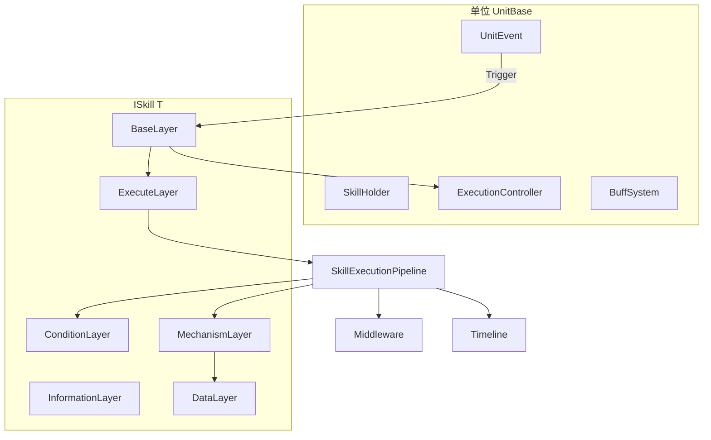

# Tech-Cosmos 技能系统 (Skill System)

> **包名**：`com.techcosmos.skillsystem`  
> **版本**：2.3.0  
> **Unity**：2022.3+  
> **运行时**：.NET Standard 2.1 / C# 9.0+  
> **测试状态**：✅ **79 项自动化测试全通过**（EditMode 61 + PlayMode 18）

面向 Unity 的**企业级、数据驱动、可扩展**技能框架。  
将技能抽象为**六层架构**，内置 **Buff 子系统（GBF）**、**条件树 / 机制树**、**技能时间轴**、**施法状态机**、**执行管线与中间件**，并提供节点图编辑器与完整 Editor 工具链。

---

## 目录

- [这是什么？适合谁用？](#这是什么适合谁用)
- [5 分钟快速理解](#5-分钟快速理解)
- [安装与目录规划](#安装与目录规划)
- [从零到跑通：完整上手流程](#从零到跑通完整上手流程)
- [编辑器菜单一览](#编辑器菜单一览)
- [架构总览](#架构总览)
- [运行时系统详解](#运行时系统详解)
  - [六层架构](#六层架构)
  - [执行管线](#执行管线)
  - [施法控制器（读条 / 引导 / 打断）](#施法控制器读条--引导--打断)
  - [条件系统与条件树](#条件系统与条件树)
  - [机制系统与机制树](#机制系统与机制树)
  - [数据层与公式](#数据层与公式)
  - [技能时间轴 Timeline](#技能时间轴-timeline)
  - [UnitBase 与事件系统](#unitbase-与事件系统)
  - [Buff 子系统](#buff-子系统)
  - [中间件](#中间件)
  - [网络扩展点](#网络扩展点)
  - [黑板与全局服务](#黑板与全局服务)
- [代码生成系统](#代码生成系统)
- [实战食谱 Cookbook](#实战食谱-cookbook)
- [测试与质量保障](#测试与质量保障)
- [生产环境集成清单](#生产环境集成清单)
- [API 速查](#api-速查)
- [项目结构](#项目结构)
- [最佳实践](#最佳实践)
- [常见问题 FAQ](#常见问题-faq)
- [版本升级说明](#版本升级说明)
- [联系与反馈](#联系与反馈)

---

## 这是什么？适合谁用？

### 解决什么问题？

在 RPG / ARPG / 卡牌 / MOBA 等游戏中，技能系统往往要同时满足：

- **策划可配**：触发时机、冷却、Buff、多段伤害、读条引导
- **程序可扩展**：自定义伤害公式、特殊条件、网络同步钩子
- **Editor 友好**：可视化编辑，少写重复样板代码
- **运行时稳定**：管线清晰、可测试、可 Profile

本框架把上述需求统一到一个体系里，避免每个项目从零造轮子。

### 适合的场景

| 场景 | 框架提供的支持 |
|------|----------------|
| 主动攻击技能 | 事件触发 + 条件 + 机制 + 冷却 |
| 读条 / 引导法术 | `castTime` / `channelTime` + 打断 |
| 多段 / 延迟伤害 | Timeline 编排 |
| Buff / Debuff | 内置 GBF Buff，与技能机制打通 |
| 被动 / 光环 | `SkillType.Passive`，AddSkill 时自动激活 |
| 复杂前置条件 | 条件树 AND / OR / NOT / Ref |
| 复合效果 | 机制树 Sequence / Parallel / Ref |

### 不适合的场景

- 完全不需要数据驱动、每个技能都纯代码硬写的极简项目
- 框架已提供 **网络接口**，但不包含具体联机同步实现（需自行对接）

---

## 5 分钟快速理解

### 一句话

**技能 = 六层对象 + 可选 Timeline；由事件触发，经管线检查后执行机制。**

### 核心流程图

```
外部调用 TriggerEvent("OnAttack", target)
        │
        ▼
UnitEvent 按优先级分发给已注册技能
        │
        ▼
BaseLayer.Trigger
        │
        ├─ 有读条/引导 → ExecutionController.TryExecute → Tick → Pipeline
        └─ 即时技能     → ExecuteLayer → Pipeline
                                    │
                    ┌───────────────┼───────────────┐
                    ▼               ▼               ▼
              Middleware        Condition        Mechanism
              （可取消）         （可阻断）        （游戏效果）
                    │               │               │
                    └───────────────┴───────────────┘
                                    │
                                    ▼
                          成功 → 启动 Timeline（可选）
```

### 三类角色分工

| 角色 | 负责什么 | 主要产物 |
|------|----------|----------|
| **策划** | 配技能/Buff/时间轴 | `SkillDataSO`、`BuffDataSO`、Composite SO |
| **程序** | 写 Unit、机制、条件 | `UnitBase` 子类、`Mechanism<T>`、`Condition<T>` |
| **TA/工具** | 维护枚举、校验资产 | Enum Editor、Validate Assets |

### 最小可运行示例

```csharp
// 1. 定义 Unit
[GenerateSkillDataSO(MenuName = "Tech-Cosmos/Skill/Hero")]
public class Hero : UnitBase<Hero>
{
    [SkillDataField(DisplayName = "攻击力")] public float Attack = 10f;
    public override string[] GetSupportedEvents() => new[] { "OnAttack" };
}

// 2. 菜单：Tech-Cosmos → SkillSystem → Generate All

// 3. 创建 SkillDataSO 并在 Skill Editor 中配置

// 4. 运行时
var so = Resources.Load<SkillDataSO<Hero>>("Skills/Slash");
hero.AddSkill(SkillFactory<Hero>.CreateSkill(so));
hero.TriggerEvent("OnAttack", enemy);   // ✅ 正确：caster=hero, target=enemy
```

> ⚠️ **常见错误**：`TriggerEvent("OnAttack", player, enemy)` — 第三个参数是 `Vector3`，不是 Unit。  
> 需要自定义 caster 时用：`TriggerEvent("OnAttack", new SkillContext<Hero>(attacker, target))`

---

## 安装与目录规划

### 安装方式

**方式 A — UPM 本地包（推荐）**

```json
// Packages/manifest.json
"com.techcosmos.skillsystem": "file:../Tech-Cosmos.Framework.SkillSystem"
```

**方式 B — 复制到 Assets**

将整个 `Tech-Cosmos.Framework.SkillSystem` 文件夹放入项目的 `Assets/` 下。

### 依赖

- Unity **2022.3 LTS** 或更高
- 无强制第三方包依赖
- 可选：Unity Test Framework（运行内置测试）

### 推荐项目目录

```
Assets/
├── Tech-Cosmos.Framework.SkillSystem/   ← 框架本体（尽量只读，便于升级）
├── _Game/
│   ├── Scripts/
│   │   ├── Units/                       ← UnitBase 子类
│   │   ├── Mechanisms/                  ← 业务机制
│   │   ├── Conditions/                  ← 业务条件
│   │   └── BuffEffects/                 ← Buff 效果执行器
│   └── Resources/
│       ├── Skills/                      ← SkillDataSO 资产
│       ├── Buffs/                       ← BuffDataSO 资产
│       └── Composites/                  ← 复合条件/机制 SO
└── Generated/                           ← 代码生成输出（建议 .gitignore）
    ├── Mechanisms/*.g.cs
    ├── Conditions/*.g.cs
    ├── SkillDataSO/*.g.cs
    └── TriggerEventType.cs 等枚举
```

### 导入 Demo Sample

1. **Package Manager** → **SkillSystem** → **Samples** → 导入 **Skill System Demo**
2. 菜单 **Tech-Cosmos → SkillSystem → Create Demo Scene**
3. 运行场景：**Space** 攻击，**H** 治疗

---

## 从零到跑通：完整上手流程

### Step 1 — 创建 Unit（角色宿主）

继承 `UnitBase<T>` 可一次性获得：事件总线、技能容器、Buff 系统、施法控制器。

```csharp
using UnityEngine;
using TechCosmos.SkillSystem.Runtime;

[GenerateSkillDataSO(MenuName = "Tech-Cosmos/Skill/Hero")]
public class Hero : UnitBase<Hero>
{
    [SkillDataField(Category = "战斗", DisplayName = "攻击力")]
    public float Attack = 15f;

    [SkillDataField(Category = "战斗", DisplayName = "当前生命")]
    public float Health = 100f;

    [SkillDataField(Category = "战斗", DisplayName = "最大生命")]
    public float MaxHealth = 100f;

    public override string[] GetSupportedEvents()
        => new[] { "OnAttack", "OnBeingHit", "OnDeath" };

    /// 含 Buff 修正后的攻击力
    public float EffectiveAttack => EvaluateStat("Attack", Attack);

    public void TakeDamage(float amount, Hero attacker = null)
    {
        Health = Mathf.Max(0f, Health - amount);
        TriggerEvent("OnBeingHit", new SkillContext<Hero>(attacker ?? this, this));
        if (Health <= 0f) TriggerEvent("OnDeath");
    }
}
```

> 若完全自定义，也可实现 `IUnit<T>` + `ISkillExecutionOwner<T>` + `IBuffHost<T>`，但工作量大得多，一般不推荐。

### Step 2 — 编写机制（Mechanism）

```csharp
[Serializable]
[RequiredData("Damage", typeof(float), DefaultValue = "10", Description = "伤害值")]
[AutoGenerateMechanism(typeof(Hero))]
[MechanismMenu("⚔ 伤害", DisplayName = "造成伤害", Priority = 1)]
public class DamageMechanism<T> : Mechanism<T> where T : class, IUnit<T>
{
    public override void Execute(SkillContext<T> context, IDataLayer<T> dataLayer)
    {
        float damage = dataLayer.GetValue<float>("Damage", context);
        // 在此实现伤害逻辑…
    }
}
```

### Step 3 — 生成代码

菜单：**Tech-Cosmos → SkillSystem → Generate All**

将生成：

| 输出 | 说明 |
|------|------|
| `Assets/Generated/Mechanisms/*.g.cs` | 封闭泛型机制，可在 SO 中 `[SerializeReference]` |
| `Assets/Generated/Conditions/*.g.cs` | 封闭泛型条件 |
| `Assets/Generated/SkillDataSO/*.g.cs` | 如 `HeroSkillDataSO` |
| 枚举文件 | `TriggerEventType`、`BuffTag` 等 |

> **每次新增/修改带 `[AutoGenerateMechanism]` / `[AutoGenerateCondition]` 的类后，都要重新 Generate All。**

### Step 4 — 创建 SkillDataSO 并配置

1. Project 右键 → **Create → Tech-Cosmos → Skill → Hero**（名称取决于你的 Unit）
2. 打开 **Tech-Cosmos → SkillSystem → Skill Editor**
3. 选中资产，配置各面板：

| 面板 | 配置内容 |
|------|----------|
| **基础** | 名称、描述、主动/被动、`TriggerEvents` |
| **Profile** | 优先级、读条、引导、可打断、标签 |
| **条件** | 条件树 或 平铺条件列表 |
| **机制** | 机制树 或 平铺机制列表 |
| **Timeline** | 可选：按时间触发机制/事件 |
| **数据层** | 数值、公式；`[RequiredData]` 自动同步的键 |

4. 保存资产

### Step 5 — 运行时挂载与触发

```csharp
public class GameBootstrap : MonoBehaviour
{
    public Hero hero;
    public Hero enemy;
    public SkillDataSO heroSlashSO;

    void Start()
    {
        if (heroSlashSO is SkillDataSO<Hero> typedSO)
            hero.AddSkill(SkillFactory<Hero>.CreateSkill(typedSO));
    }

    void Update()
    {
        if (Input.GetKeyDown(KeyCode.Space))
            hero.TriggerEvent("OnAttack", enemy);
    }
}
```

**被动技能**：`SkillType = Passive` 时，`AddSkill(skill, caster)` 会**立即执行一次**，之后仍响应 `TriggerEvents`。

---

## 编辑器菜单一览

当前菜单已精简为 **11 项**（无重复子菜单）：

```
Tech-Cosmos/SkillSystem/
├── Generate All              ← 机制 + 条件 + SkillDataSO + Buff 效果 + 枚举（首选入口）
├── Skill Editor              ← 主技能编辑器
├── Buff Editor               ← Buff 资产编辑器
├── Graph Editor              ← 节点图可视化编辑
├── Enum Editor               ← 触发事件 / Buff 标签等枚举
├── Validate Assets           ← 扫描全部 Skill + Buff 资产配置问题
├── Clear Generated Code      ← 清空 Assets/Generated/
├── Create Skill Script       ← 新建机制/条件脚本模板
├── Create Buff Script        ← 新建 Buff 效果脚本模板
├── Create Demo Scene         ← 导入 Sample 后可用
└── Help                      ← 简要流程提示
```

### 各工具用途速查

| 菜单 | 何时使用 |
|------|----------|
| **Generate All** | 新增机制/条件/Unit 后；拉代码后首次打开项目 |
| **Skill Editor** | 配置技能 SO 的主界面 |
| **Buff Editor** | 配置 Buff SO |
| **Graph Editor** | 需要节点图方式编辑 Skill/Buff/Composite |
| **Enum Editor** | 维护 `TriggerEventType` 等枚举，避免手改生成文件 |
| **Validate Assets** | 提交前 / 里程碑前批量检查配置 |
| **Clear Generated Code** | 生成出错或换 Unit 类型时清理重来 |

---

## 架构总览

### 六层 + 管线



### 一次技能执行的完整时序

```
1. unit.TriggerEvent("OnAttack", context)
2. UnitEvent 按 priority 调用各技能 BaseLayer.Trigger
3. ActiveBaseLayer：
   - caster 有 ExecutionController → TryExecute（可能进入读条/引导）
   - 否则 → ExecuteLayer.Execute
4. SkillExecutionPipeline.Execute：
   a. 分配 executionId，WithSkill 绑定当前技能
   b. 全局 + 局部 Middleware.OnBeforeExecute（可设置 cancelled）
   c. Executing 事件（实例 + 全局）
   d. ConditionLayer.CheckCondition
      └─ 失败 → OnConditionFailed + Failed → 返回 ConditionFailed
   e. MechanismLayer.Mechanism（ContinueOnError / FailFast）
   f. 条件 OnSkillExecuted（如 Cooldown 开始计时）
   g. Middleware.OnAfterExecute
   h. Executed 事件
   i. 成功且 Timeline.enabled → SkillTimelineService.Play
5. Update 中 SkillTimelineService.Tick → 到点执行 clip
```

### 泛型 / 非泛型双轨

| 层级 | 运行时（类型安全） | 编辑器序列化 |
|------|-------------------|--------------|
| 条件 | `Condition<T>` | `ConditionBase` + `[SerializeReference]` |
| 机制 | `Mechanism<T>` | `MechanismBase` + `[SerializeReference]` |
| 配置 | `SkillDataSO<T>` | `SkillDataSO` 基类 |

编辑器里配置非泛型基类；`SkillFactory` / `CreateSkill` 编译为泛型运行时实例。

---

## 运行时系统详解

### 六层架构

| 层 | 职责 |
|----|------|
| **BaseLayer** | 订阅 `TriggerEvents`，技能入口 |
| **InformationLayer** | 名称、描述 |
| **ConditionLayer** | 释放前检查 |
| **MechanismLayer** | 执行游戏效果 |
| **DataLayer** | 键值、公式、随机数 |
| **ExecuteLayer** | 转发 Pipeline，广播 Executing / Executed / Failed |

| SkillType | BaseLayer | 行为 |
|-----------|-----------|------|
| **Active** | `ActiveBaseLayer` | 等事件触发 |
| **Passive** | `PassiveBaseLayer` | AddSkill 时立即执行一次 |

### 执行管线

```csharp
var result = SkillExecutionPipeline.Execute(
    skill,
    context,
    middleware: optionalList,                              // 可选：本次局部中间件
    mechanismPolicy: MechanismErrorPolicy.ContinueOnError // 或 FailFast
);
```

**SkillExecutionResult 枚举**

| 值 | 含义 |
|----|------|
| `Success` | 条件通过且机制执行完成 |
| `ConditionFailed` | 条件未满足 |
| `Cancelled` | 被中间件取消 |
| `Casting` / `Channeling` | 施法阶段（控制器层） |
| `Blocked` | 被更高优先级阻塞 |
| `Error` | 管线抛出未捕获异常 |

**调试工具**

- Profiler 标记：`SkillSystem.Execute` / `Mechanism` / `Formula`
- 追踪环：`SkillExecutionTrace.GetRecentEntries()`
- 机制异常：`MechanismLayer` 会 `LogError` 并依策略继续或停止（测试 FailFast 用例会故意触发，属正常现象）

### 施法控制器（读条 / 引导 / 打断）

配置在 `SkillProfile`：

```csharp
public class SkillProfile
{
    public int executionPriority;   // 越大越优先；高优先级可打断低优先级读条
    public float castTime;          // 读条（秒）
    public float channelTime;       // 引导（秒）
    public bool canBeInterrupted;   // 是否可被伤害/沉默等打断
    public List<string> tags;
}
```

**流程**

```
castTime > 0 或 channelTime > 0
  → Casting →（可选）Channeling → CompleteCast → Pipeline.Execute
否则
  → 直接 Pipeline.Execute
```

**API**

```csharp
hero.ExecutionController.TryInterrupt(InterruptReason.Damage);
hero.ExecutionController.Cancel(); // Manual
hero.ExecutionController.OnCastCompleted += (skill, ctx) => { };
hero.ExecutionController.OnCastInterrupted += (skill, reason) => { };
```

**前提**：施法者需 `ISkillExecutionOwner<T>`（`UnitBase` 已实现）；`UnitBase.Update` 会自动 `ExecutionController.Tick()`。

**OnCastCompleted 语义**：仅在 Pipeline **成功**（`Success`）后触发；读条完成但条件失败不会触发。

### 条件系统与条件树

#### 代码组合

```csharp
var cond = healthCheck & manaCheck | !stunCheck;
// & → AndCondition   | → OrCondition   ! → NotCondition
```

#### 内置条件

| 条件 | 说明 |
|------|------|
| `CooldownCondition<T>` | 冷却；`OnSkillExecuted` 后开始计时 |
| `HasBuffCondition<T>` | 检查目标/施法者 Buff 及层数 |
| `HasTagCondition<T>` | 检查 `TagContainer` |
| `FuncCondition<T>` | Lambda 包装 |
| `CachedCondition<T>` | 同上下文缓存结果 |
| `And/Or/NotCondition<T>` | 逻辑组合 |

#### 条件树节点

| 节点 | 说明 |
|------|------|
| `ConditionTreeLeaf` | 单个条件 |
| `ConditionTreeAnd` / `Or` / `Not` | 逻辑组合 |
| `ConditionTreeRef` | 引用 `CompositeConditionSO` |

编译：`ConditionTreeCompiler.Compile<T>(root)` → 单个 `Condition<T>`。

`SkillDataSO` 字段：

- `useConditionTree = true`（默认）→ 使用 `conditionTreeRoot`
- `useConditionTree = false` → 使用平铺 `Conditions` 列表（旧版兼容）

> 循环 Ref 会 `LogWarning` 并返回 null，不会 silent fail。

### 机制系统与机制树

#### 内置机制

| 机制 | 说明 |
|------|------|
| `ApplyBuffMechanism<T>` | 施加 Buff（SO 或 SimpleBuff） |
| `RemoveBuffMechanism<T>` | 按名称/目标移除 Buff |

#### 机制树节点

| 节点 | 语义 |
|------|------|
| `MechanismTreeLeaf` | 执行单个机制 |
| `MechanismTreeSequence` | 顺序执行 |
| `MechanismTreeParallel` | 同批执行（单线程依次调用） |
| `MechanismTreeRef` | 引用 `CompositeMechanismSO` |

#### SkillBack 回滚

```csharp
public override void SkillBack(ISkill<T> skill)
{
    // RemoveSkill / OnRemove 时调用，用于撤销 Buff、还原状态
}
```

#### 错误策略

```csharp
// 默认 ContinueOnError：记录 LogError，继续后续机制
// FailFast：首个异常机制后停止
mechanismLayer.ErrorPolicy = MechanismErrorPolicy.FailFast;
```

> 类型不匹配（如 `Mechanism<WrongUnit>` 对 `Hero` 执行）会 `LogWarning`，不会抛异常。

### 数据层与公式

#### 读取

```csharp
float dmg = dataLayer.GetValue<float>("DamageFormula", context);
```

支持：`float/int/string/bool`、`FormulaValue`、`RandomValue`、`Func<SkillContext<T>,T>` 委托。

#### 公式语法

```
caster.Attack * 1.5 + target.MaxHealth * 0.1
(caster.Attack - target.Defense) * 2.0
random(0, 100) * 0.01
10/2+3
10-3*1
```

支持：`+ - * /`、括号、一元负号、`caster.xxx` / `target.xxx` 属性路径、`random(min,max)`。  
运算符优先级：先 `*` `/`，后 `+ `-`。

#### RequiredData

```csharp
[RequiredData("BuffId", typeof(string), DefaultValue = "Haste")]
[RequiredData("DamageFormula", typeof(float), IsFormula = true,
    FormulaType = FormulaValue.FormulaType.Custom,
    CustomFormula = "caster.Attack * 2")]
```

编辑器会：自动创建条目、锁定必要项（🔒）、检测类型冲突。  
`SyncRequiredDataEntries` 为**只增不删**，不会覆盖策划已改的值。

### 技能时间轴 Timeline

```csharp
public class SkillTimelineData
{
    public bool enabled;
    public float totalDuration;
    public List<SkillTimelineClip> clips;
}

public class SkillTimelineClip
{
    public SkillTimelineClipType clipType;  // Mechanism | EventMarker | PhaseLabel
    public float startTime;
    public string eventName;                // EventMarker
    public MechanismBase mechanism;         // Mechanism
}
```

- **启动时机**：Pipeline **成功**后 `SkillTimelineService.Play`
- **Tick**：`UnitBase.Update` 自动 Tick；也可手动 `SkillTimelineService.Tick(delta)`
- **按单位停止**：`SkillTimelineService.StopForOwner(unit)` — 打断/死亡时清理
- **同一 clip 不重复执行**：内部 `_executedClipIndices` 保证
- **大 delta 不丢 clip**：单次 Tick 会执行所有已到时间的 clip

### UnitBase 与事件系统

`UnitBase<T>` 集成：

| 组件 | 说明 |
|------|------|
| `UnitEvent<T>` | 订阅/发布，支持 priority |
| `SkillHolder<T>` | AddSkill / RemoveSkill / 被动激活 |
| `BuffSystem<T>` | Buff 管理 |
| `TagContainer` | 标签；Buff 增删时自动同步 |
| `SkillExecutionController<T>` | 读条/引导/打断 |

```csharp
// ✅ 推荐：以自身为 caster
hero.TriggerEvent("OnAttack", enemy);

// ✅ 完整控制 caster / target
hero.TriggerEvent("OnBeingHit", new SkillContext<Hero>(attacker, hero));

// ❌ 错误：第三参数是 Vector3，不是 Unit
hero.TriggerEvent("OnAttack", player, enemy);

// 技能管理
hero.AddSkill(skill);
hero.RemoveSkill(skill);
hero.TryGetSkill("重击", out var slash);
```

同一事件可触发**多个技能**（按各自 priority 排序）。  
`RemoveSkill` 会取消事件订阅并调用 `SkillBack`。

### Buff 子系统

目录：`Runtime/Buff/GBF/`（Game Buff Framework，已内置，无需单独 Buff 包）。

```csharp
// 轻量运行时 Buff
hero.BuffSystem.AddBuff(new SimpleBuff<Hero>(
    hero, "Haste", duration: 5f,
    tags: new[] { "Buff" },
    modifiers: new[] {
        new StatModifier { statKey = "Attack", operation = ModifierOperation.Add, value = 10f }
    },
    caster: hero,
    stackPolicy: BuffStackPolicy.StackAndRefresh,
    maxStacks: 3));

float atk = hero.EvaluateStat("Attack", baseAttack);

hero.BuffSystem.DispelByTags("Debuff", "Poison");
hero.BuffSystem.RemoveBuffsByName("Mark");
```

**叠层策略**

| BuffStackPolicy | 行为 |
|-----------------|------|
| `ExtendDuration` | 刷新 duration |
| `StackAndRefresh` | 叠层 + 刷新 |
| `Replace` | 替换旧实例 |
| `Independent` | 允许同名并存 |

**HasAllBuff**：每个 tag 需在**至少一个** Buff 上出现（跨 Buff 联合语义）。

**ClearBuff**：清空并触发每个 Buff 的 `OnBuffRemoved`。

### 中间件

```csharp
public class LoggingMiddleware : SkillMiddlewareBase
{
    public override bool OnBeforeExecute<T>(ISkill<T> skill, ref SkillContext<T> context)
    {
        if (shouldBlock) { context.meta.cancelled = true; return true; }
        return true; // false 也会标记 cancelled
    }

    public override void OnAfterExecute<T>(ISkill<T> skill, SkillContext<T> ctx, SkillExecutionResult result)
        => Debug.Log($"{skill.InformationLayer.Name} → {result}");
}

SkillSystemServices.RegisterMiddleware(new LoggingMiddleware());
```

顺序：先**全局** `SkillSystemServices.GlobalMiddleware`，再本次传入的局部列表。

### 网络扩展点

框架提供接口，**不含**具体网络实现：

```csharp
public interface ISkillNetworkBridge<T>
{
    bool ValidateServer(SkillCommand command, T caster);
    void ApplyPredicted(SkillCommand command, T caster);
    void Rollback(SkillCommand command, T caster);
    SkillCommand CreateCommand(ISkill<T> skill, SkillContext<T> context);
}
```

配合 `SkillExecutionMeta.networkRole`、`ISkillClock`、`IRandomProvider` 种子实现确定性回放。

### 黑板与全局服务

```csharp
context.meta.blackboard.Set("HitCount", 3);
context.meta.blackboard.TryGet<int>("HitCount", out var count);

SkillSystemServices.Clock = new FixedSkillClock(time, deltaTime);  // 测试 / 确定性逻辑
SkillSystemServices.Random = new SeededRandomProvider(12345);
SkillSystemServices.ClearMiddleware();
```

---

## 代码生成系统

### 特性一览

| 特性 | 作用 |
|------|------|
| `[GenerateSkillDataSO]` | 为 Unit 生成 `XxxSkillDataSO` |
| `[AutoGenerateMechanism(typeof(Unit))]` | 生成封闭机制 `.g.cs` |
| `[AutoGenerateCondition]` | 生成封闭条件 `.g.cs` |
| `[SkillDataField]` | 字段暴露到 SO / 公式引用 |
| `[RequiredData]` | 声明机制/条件依赖的数据键 |
| `[MechanismMenu]` / `[ConditionMenu]` | 编辑器分类菜单 |
| `[ApplyBuffTarget]` | 标记 Unit 可作为 Buff 目标 |

### 生成流程

```
编写 Mechanism<T> / Condition<T> + Attribute
        ↓
Tech-Cosmos → SkillSystem → Generate All
        ↓
Assets/Generated/**/*.g.cs + 枚举更新
        ↓
Unity 编译 → Skill Editor 中可选新类型
```

### .gitignore 建议

```gitignore
Assets/Generated/
```

CI 可在构建前执行 Generate All，或团队约定提交生成物（二选一，不要混用）。

---

## 实战食谱 Cookbook

### 带冷却的主动攻击

1. 条件树：`Leaf → CooldownCondition`（cooldown = 2s）
2. 机制：`DamageMechanism`
3. 数据层：`Damage = caster.Attack * 1.2`（FormulaValue）
4. `TriggerEvents = ["OnAttack"]`

### 读条火球术

1. Profile：`castTime = 1.5f`，`canBeInterrupted = true`
2. Unit 继承 `UnitBase`
3. 机制：伤害 + 可选 `ApplyBuffMechanism`（Burn）
4. 监听 `OnCastInterrupted`

### 多段伤害 Timeline

1. `Timeline.enabled = true`，`totalDuration = 1.0`
2. Clips：
   - `t=0.3` → DamageMechanism（50%）
   - `t=0.6` → DamageMechanism（50%）
   - `t=0.3` → EventMarker `"OnTimelineHit"`（链式触发其他技能）

### 受击反击（OnBeingHit）

1. 在**被攻击者**上注册技能，`TriggerEvents = ["OnBeingHit"]`
2. 机制中对 `context.caster`（攻击者）造成伤害
3. 触发示例：`target.ReceiveDamage(dmg, attacker)` 内调用  
   `TriggerEvent("OnBeingHit", new SkillContext<Hero>(attacker, this))`

### 被动光环

1. `SkillType = Passive`
2. 机制：`ApplyBuffMechanism`（`applyToTarget = false`）
3. `AddSkill` 时自动激活

### 纯代码构建技能（无 SO）

```csharp
var data = new SkillData<Hero>
{
    SkillName = "代码重击",
    SkillType = SkillType.Active,
    TriggerEvents = new List<string> { "OnAttack" },
    Profile = new SkillProfile { executionPriority = 5 }
};
data.Conditions.Add(new CooldownCondition<Hero> { cooldown = 1.5f });
data.AddMechanism(new TestDamageMechanism<Hero> { baseDamage = 20f });

hero.AddSkill(SkillFactory<Hero>.CreateSkill(data));
```

### 附加资源路径（图标 / 特效）

```csharp
var skill = SkillFactory<Hero>.CreateSkill(so)
    .WithResources(("Icon", "UI/Skills/Slash"), ("VFX", "VFX/Slash"));
string icon = skill.GetResource("Icon");
```

---

## 测试与质量保障

### 运行方式

1. **Window → General → Test Runner**
2. **EditMode** → 程序集 `TechCosmos.SkillSystem.Tests` → Run All
3. **PlayMode** → 若项目含 PlayMode 集成测试程序集 → Run All

### 覆盖概览（79 项）

| 程序集 | 数量 | 覆盖重点 |
|--------|------|----------|
| `TechCosmos.SkillSystem.Tests`（EditMode） | **61** | 公式、Tag、Buff、条件/机制树、Pipeline、Timeline、施法控制器、中间件、FailFast |
| 项目 PlayMode 测试（可选） | **18** | Unit 全链路、冷却、引导、Timeline 链式、OnBeingHit 反击等 |

**EditMode 测试文件**

| 文件 | 主要内容 |
|------|----------|
| `SkillSystemCoreTests.cs` | 公式 precedence、Buff 叠层/HasAllBuff/ClearBuff、Cooldown、树编译、Timeline、施法控制器 |
| `SkillSystemExtendedTests.cs` | 复合条件、HasBuff/HasTag、Pipeline、SkillHolder、Buff 驱散 |
| `SkillSystemRobustnessTests.cs` | 引导施法、FailFast/ContinueOnError、公式引用、Trace、优先级打断 |

### 控制台中的预期 Error 日志

运行 EditMode 时，可能看到：

```
[MechanismLayer] 机制执行异常 [ThrowingMechanism]: boom
```

来自 **FailFast / ContinueOnError** 鲁棒性测试故意抛错，**测试通过即正常**，不是框架 Bug。

---

## 生产环境集成清单

框架测试全绿后，建议在**真实项目**中完成：

| 步骤 | 操作 | 目的 |
|------|------|------|
| 1 | **Generate All** | 同步机制/条件/SO/枚举 |
| 2 | **Validate Assets** | 扫描 Skill + Buff 配置 |
| 3 | 创建/打开测试场景 | 手动验证关键技能 |
| 4 | 检查 `TriggerEvents` 与 Unit 一致 | 避免事件名拼写错误 |
| 5 | 确认 `.gitignore` Generated 策略 | 团队统一代码生成流程 |
| 6 | （可选）Profiler 压测 | 多单位 + 多 Timeline 同时运行 |
| 7 | （若联机）实现 `ISkillNetworkBridge` | 框架不含网络层实现 |

**结论**：框架本体已达生产可用质量；业务 SO、美术资源、网络与性能需项目侧验收。

---

## API 速查

### 工厂

```csharp
SkillFactory<T>.CreateSkill(SkillData<T> data);
SkillFactory<T>.CreateSkill(SkillDataSO<T> so);
so.CreateSkill<T>();  // 扩展方法
```

### 上下文

```csharp
var ctx = new SkillContext<T>(caster, target, targetPos);
ctx = ctx.WithSkill(skill);
```

### 条件运算符

```csharp
Condition<T> c = a & b | !c;
```

### Pipeline

```csharp
SkillExecutionPipeline.Execute(skill, context, middleware, policy);
```

### ExecuteLayer 事件

```csharp
skill.ExecuteLayer.Executed += ctx => { };
ExecuteLayer<T>.OnAnySkillExecuted += ctx => { };
```

### 公式

```csharp
FormulaEvaluator.Evaluate(context, "caster.Attack * 2");
FormulaEvaluator.EvaluateExpressionStatic("(2+3)*4");
FormulaEvaluator.ClearCache();
```

### Timeline

```csharp
SkillTimelineService.Tick(deltaTime);
SkillTimelineService.StopForOwner(unit);
SkillTimelineService.StopAll();
```

---

## 项目结构

```
Tech-Cosmos.Framework.SkillSystem/
├── package.json
├── README.md
├── Runtime/
│   ├── Core/              UnitBase, SkillContext, SkillHolder, SkillSystemServices…
│   ├── Layers/            六层实现
│   ├── Conditions/        条件、条件树、内置实现
│   ├── Mechanisms/        机制、机制树、内置实现
│   ├── Data/              SkillData, SkillDataSO
│   ├── Pipeline/          Pipeline, Middleware, Result, Trace
│   ├── State/             SkillExecutionController
│   ├── Timeline/          Timeline 数据与服务
│   ├── Buff/              GBF 核心 + SimpleBuff, TagContainer
│   ├── Events/            UnitEvent
│   ├── Network/           SkillCommand, ISkillNetworkBridge
│   ├── Management/        SkillFactory
│   ├── Extensions/        ResourceLayer 等
│   ├── FormulaEvaluator.cs
│   └── SystemAttribute.cs 代码生成/Editor 特性
├── Editor/
│   ├── SkillDataSOEditorWindow.cs
│   ├── SkillSystemGeneratorMenu.cs
│   ├── MechanismCodeGenerator.cs
│   ├── Graph/             节点图编辑器
│   ├── Buff/              Buff 编辑器与生成
│   └── *Drawer.cs, *Validator.cs
├── Samples~/Demo/
└── Tests/Runtime/         EditMode 单元测试（61 项）
```

---

## 最佳实践

### 设计

1. **机制单一职责** — 一个机制只做一件事  
2. **数值进数据层** — 公式放 `FormulaValue`，逻辑放机制  
3. **优先 UnitBase** — 不要重复实现事件/Buff/施法  
4. **Composite SO 复用** — 相同条件/机制组合用 Ref 节点  
5. **Timeline 做分段** — 多段伤害用 Timeline，少写 Delay 协程  

### 性能

| 建议 | 原因 |
|------|------|
| 昂贵条件用 `CachedCondition` | 同帧重复检查 |
| 简单效果用 `Action` 机制 | 比 SerializeReference 轻 |
| 公式表达式会缓存 | 静态表达式自动 cache；改公式后 `ClearCache` |

### 协作

- 框架目录保持只读，业务代码放 `_Game/`
- 新增机制后通知策划重新 Generate All
- 里程碑前跑 **Validate Assets** + Test Runner

---

## 常见问题 FAQ

### Q1：机制/条件没出现在编辑器菜单？

1. 运行 **Generate All**  
2. 确认类有 `[Serializable]`、非 abstract、已生成 `.g.cs`  
3. 菜单分类来自 `[MechanismMenu]` / `[ConditionMenu]`  
4. MechanismDrawer 会按 `SkillDataSO.GetUnitType()` 过滤 `Mechanism<T>` 的 T  

### Q2：条件树改了但不生效？

1. `useConditionTree = true` 且 `conditionTreeRoot` 非空  
2. 叶子必须是**当前 Unit 的封闭子类**  
3. 修改 SO 后需重新 `CreateSkill` / 重新 AddSkill  

### Q3：读条/引导不生效？

1. Unit 继承 `UnitBase` 或实现 `ISkillExecutionOwner<T>`  
2. `Profile.castTime` / `channelTime > 0`  
3. 不要禁用 `UnitBase` 所在物体的 Update  

### Q4：Timeline 不播放？

1. `Timeline.enabled = true`，clips 非空  
2. Pipeline 必须 **Success** 后才 Play  
3. 有对象在 Tick（`UnitBase.Update` 或手动 Tick）  

### Q5：TriggerEvent 行为不符合预期？

```csharp
// ✅
unit.TriggerEvent("OnAttack", target);
unit.TriggerEvent("OnX", new SkillContext<T>(caster, target));

// ❌ 第三参数不是 Unit
unit.TriggerEvent("OnAttack", a, b);
```

### Q6：RequiredData 没自动出现？

1. 机制/条件已添加到技能  
2. 重新打开 Skill Editor  
3. 已运行 Generate All  

### Q7：还要单独装 BuffSystem 包吗？

**不需要**。v2.2.0+ 已内置 `Runtime/Buff/GBF/`。删除旧 `Tech-Cosmos.Framework.BuffSystem` 避免重复编译。

### Q8：多个技能同名？

`SkillHolder` 后者覆盖前者并 Warning — 请保证 `SkillName` 唯一。

### Q9：被动技能何时执行？

`AddSkill(skill, caster)` 时立即一次；之后每次匹配 `TriggerEvents` 也会执行。

### Q10：如何调试执行流程？

1. 注册 Logging 中间件  
2. 订阅 `ExecuteLayer.Executing / Executed / Failed`  
3. Profiler 查看 `SkillSystem.*`  
4. `SkillExecutionTrace.GetRecentEntries()`  

---

## 版本升级说明

### 从 v1.x / 早期 v2 迁移

| 变更 | 迁移 |
|------|------|
| `TriggerEvent` 单字符串 | → `TriggerEvents` 列表 |
| 手动 IUnit | → 推荐 `UnitBase<T>` |
| 平铺条件/机制 | → 可选树结构（旧字段仍兼容） |
| 独立 Buff 包 | → 删除，用内置 Buff |
| Generator 多级子菜单 | → 精简为 **Generate All** 等 11 项 |

### v2.3.0 要点

- 条件树 / 机制树 + Composite SO + Graph Editor  
- 施法状态机（读条/引导/打断/优先级）  
- Pipeline + Middleware + Trace + Profiler  
- 内置 GBF Buff；`Validate Assets`（Skill + Buff）  
- **79 项自动化测试**覆盖核心与复杂场景  

---

## 联系与反馈

**作者**：[Tech-Cosmos](https://github.com/PeterParkers007/Tech-Cosmos)  
**邮箱**：3427463164@qq.com  

---

> 📌 **快速入口**：菜单 **Tech-Cosmos → SkillSystem → Help** 可查看精简版流程提示；完整说明以本文档为准。
